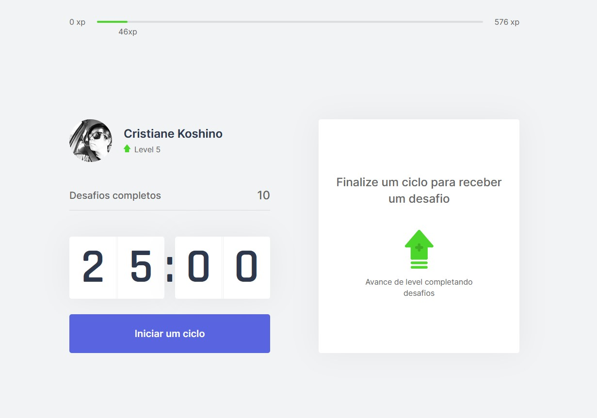
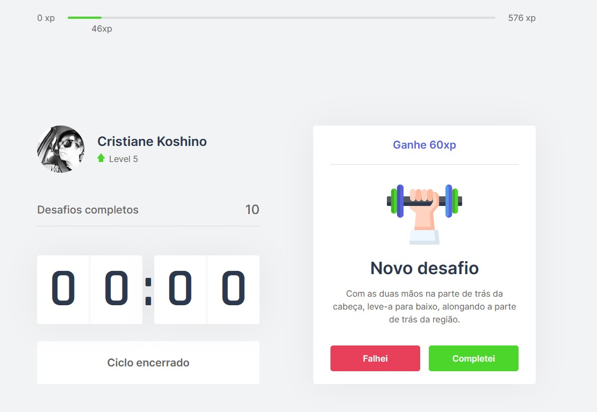
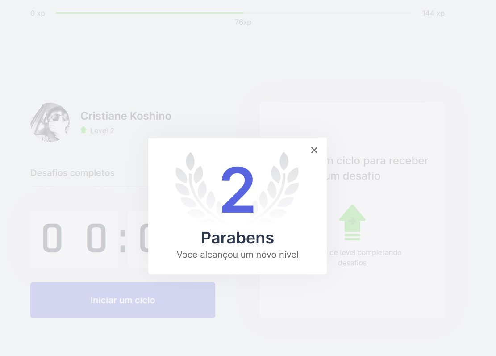

# MOVE IT
<p align="center">

</p>
<p align="center">Projeto desenvolvido durante a Next Level Week #4 da RocketSeat </p>

<br />

# Proposta
<p>Desenvolver uma aplicação web que ajude o usuário realizar pausas e exercícios durante a utilização do computador.
 </p>
<br />

# :computer: Aplicação

- Tela do timer
<p align="center">

</p>

- Tela ao finalizar um ciclo (tempo entre uma pausa e outra)
<p align="center">

</p>

- Tela ao completar um desafio
<p align="center">

</p>

# :rocket: Technologies

- Next.js
- Typescript
- React.js
- Html 5
- Css 3 / SCSS

# :heavy_check_mark: Deploy

- Vercel: [moveit.cristianekoshino](https://moveit-cristianekoshino.vercel.app/)

# :video_game: Run

### Run Application

```bash
    #Instalar dependências:
    $ npm install

    # Rodar Aplicação:
    $ npm run dev
```
